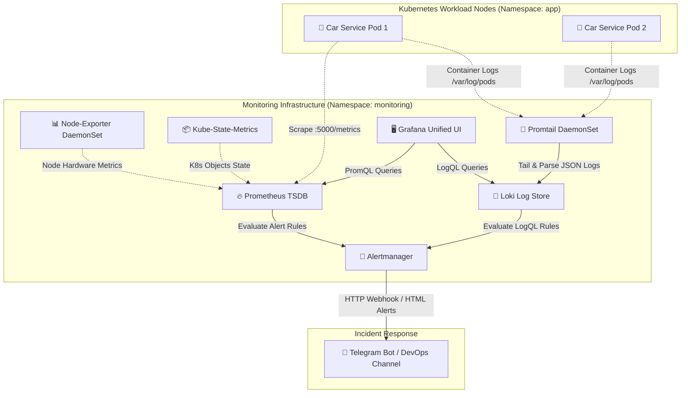

# Kubernetes Observability & Alerting Stack (PLG)

> Hệ thống giám sát toàn diện và cảnh báo tự động trên nền tảng Kubernetes sử dụng bộ ba **Prometheus, Loki, Grafana** và tích hợp thông báo qua **Telegram**.

[](https://kubernetes.io/)
[](https://prometheus.io/)
[](https://grafana.com/oss/loki/)
[](https://grafana.com/)
[](https://prometheus.io/docs/alerting/latest/alertmanager/)

---

## 📑 Mục Lục
1. [Tổng Quan](#-tổng-quan)
2. [Kiến Trúc Hệ Thống](#-kiến-trúc-hệ-thống)
3. [Cấu Trúc Thư Mục](#-cấu-trúc-thư-mục)
4. [Hướng Dẫn Cài Đặt](#-hướng-dẫn-cài-đặt)
5. [Kịch Bản Kiểm Thử & Cảnh Báo](#-kịch-bản-kiểm-thử--cảnh-báo)
6. [Tra Cứu PromQL & LogQL](#-tra-cứu-promql--logql)
7. [Tác Giả](#-tác-giả)

---

## 🎯 Tổng Quan

Dự án cung cấp giải pháp **Quan sát toàn diện (Full Observability)** cho hệ thống phân tán chạy trên Kubernetes:

* **Metrics (Chỉ số hệ thống):** Prometheus thu thập dữ liệu phần cứng (CPU, RAM, Disk) và trạng thái Pods theo thời gian thực.
* **Logs (Nhật ký tập trung):** Loki kết hợp Promtail thu thập log container, phân tích định dạng JSON mà không cần lập chỉ mục toàn văn bản (tiết kiệm chi phí).
* **Visualization (Trực quan hóa):** Grafana cung cấp giao diện bảng điều khiển (Dashboard) tập trung.
* **Alerting (Cảnh báo sự cố):** Alertmanager tự động gửi cảnh báo tức thì về nhóm Telegram khi phát hiện bất thường.

---

## 🏛️ Kiến Trúc Hệ Thống



---

## 📂 Cấu Trúc Thư Mục

```text
k8s-plg-observability-stack/
├── .github/workflows/
│   └── lint-and-test.yml          # CI: Tự động kiểm tra cú pháp Helm & Rules
├── helm/values/
│   ├── prometheus-stack-values.yaml  # Cấu hình Prometheus, Alertmanager, Telegram
│   └── loki-values.yaml              # Cấu hình Loki & Promtail pipeline
├── alerts/
│   ├── prometheus-rules.yaml          # Rule cảnh báo CPU và Pod CrashLoop
│   └── loki-rules.yaml                # Rule cảnh báo lỗi HTTP 404/500
├── dashboards/
│   ├── car-serv-app-telemetry.json    # Dashboard giám sát ứng dụng & log
│   ├── k8s-cluster-overview-1860.json # Dashboard giám sát cụm Node K8s
│   └── k8s-loki-logs-13639.json       # Dashboard phân tích Log Streams
├── scripts/
│   ├── 01-deploy-monitoring.sh        # Script tự động cài đặt toàn bộ Stack
│   ├── 02-test-alerts.sh              # Script giả lập sự cố kiểm thử cảnh báo
│   └── 03-cleanup.sh                  # Script dọn dẹp tài nguyên
└── README.md                          # Tài liệu hướng dẫn
```

---

## 🚀 Hướng Dẫn Cài Đặt

### 1. Yêu Cầu Môi Trường
* Cụm Kubernetes v1.26+ (GKE, EKS, Minikube hoặc K3s).
* Đã cài đặt `kubectl` và `helm` v3.12+.
* Token Bot và Chat ID Telegram (tạo từ `@BotFather` và `@userinfobot`).

### 2. Cấu Hình Telegram Alert
Mở file `helm/values/prometheus-stack-values.yaml` và cập nhật thông tin Telegram:

```yaml
receivers:
  - name: 'telegram-notifications'
    telegram_configs:
      - bot_token: 'YOUR_TELEGRAM_BOT_TOKEN'
        chat_id: YOUR_TELEGRAM_CHAT_ID
        send_resolved: true
```

### 3. Triển Khai Bằng Script
Chạy lệnh sau để tự động cài đặt toàn bộ hệ thống:

```bash
chmod +x scripts/*.sh
./scripts/01-deploy-monitoring.sh
```

### 4. Truy Cập Grafana
Lấy địa chỉ IP hoặc Port-forward để vào giao diện:

```bash
kubectl port-forward svc/prometheus-grafana -n monitoring 3000:80
```

* **URL:** `http://localhost:3000`
* **User:** `admin` | **Password:** `adminPasswordChangeMe123!`

---

## 🧪 Kịch Bản Kiểm Thử & Cảnh Báo

Dự án tích hợp script `scripts/02-test-alerts.sh` để kiểm thử 3 kịch bản sự cố trong thực tế:

```bash
./scripts/02-test-alerts.sh http://<IP_UNG_DUNG>
```

| Kịch Bản | Mô Tả Giả Lập | Cơ Chế Phát Hiện | Biểu Thức Query | Kết Quả |
| :--- | :--- | :--- | :--- | :--- |
| **1. CPU Quá Tải** | Gửi 250 req/s liên tục trong 3 phút | Prometheus TSDB | `node_cpu_utilisation > 80%` | Bắn tin cảnh báo về Telegram sau 3 phút. |
| **2. Đột Biến Lỗi 404** | Gửi liên tục 50 request vào URL lỗi | Loki LogQL | `count_over_time(404[5m]) > 10` | Bắn cảnh báo phát hiện quét lỗi 404 về Telegram. |
| **3. Pod CrashLoop** | Tạo Pod lỗi liên tục khởi động lại | Prometheus Counter | `increase(restarts_total[5m]) > 3` | Bắn cảnh báo Pod hỏng về Telegram sau 1 phút. |

---

## 📈 Tra Cứu PromQL & LogQL

### PromQL Cơ Bản (Prometheus)
```promql
# Đo % CPU sử dụng trên từng Node:
(1 - avg(rate(node_cpu_seconds_total{mode="idle"}[5m])) by (instance)) * 100

# Đo lượng RAM tiêu thụ của từng Pod:
sum(container_memory_working_set_bytes{namespace="app"}) by (pod)

# Đo tần suất request đến Backend API:
sum(rate(http_requests_total[5m])) by (route, status_code)
```

### LogQL Cơ Bản (Loki)
```logql
# Xem trực tiếp log của ứng dụng:
{app="car-serv-app"}

# Lọc log chứa mã lỗi 500:
{app="car-serv-app"} |= " 500 "

# Bóc tách JSON và lọc request có độ trễ > 500ms:
{app="car-serv-app"} | json | request_time > 0.5
```

---

## 👨‍💻 Tác Giả

* **Sinh viên thực hiện:** Nguyễn Quang Tùng
* **Chuyên ngành:** Kỹ thuật mạng - Trường Khoa học Máy tính, Đại học Duy Tân (DTU)
* **Đề tài:** *Triển khai giải pháp giám sát và cảnh báo tự động trên Kubernetes sử dụng Prometheus, Loki và Grafana.*
